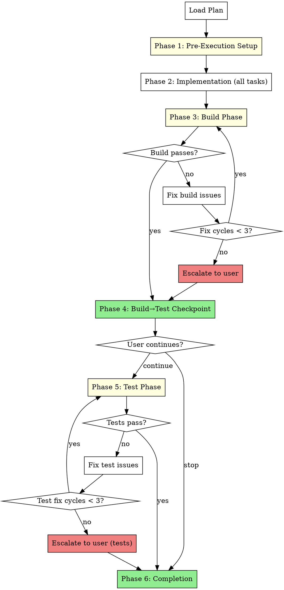

# One-Shot Development

Execute all plan tasks sequentially without human checkpoints, then run build and test phases with fix loops.

**Core principle:** Trust the plan. Execute everything, validate at the end.

**Warning:** This mode is NOT recommended for most use cases. Use only when:
- The plan is well-tested and unambiguous
- You trust the agent to execute without oversight
- You want minimal interaction during implementation

<requirements>
## Requirements

1. Execute all tasks without human checkpoints. Pausing defeats one-shot purpose.
2. Run build phase with fix loops (max 3 cycles). Unlimited loops risk infinite execution.
3. Ask user before proceeding to test phase. Build success is a natural checkpoint.
4. Invoke finishing-a-development-branch at completion. Standard completion pattern.
</requirements>

## When to Use

**Use this skill when:**
- Plan is comprehensive with exact file paths and complete code
- Tasks are independent enough that mid-flight adjustments aren't needed
- You want to "fire and forget" and review only at build/test phase
- Plan has been validated through research and assumption checking

**Don't use when:**
- Plan has vague tasks ("add validation", "improve error handling")
- Tasks have complex interdependencies that might need runtime adjustment
- This is exploratory work where you expect to change direction
- You want human oversight during implementation

## Arguments

- Plan path: First argument (e.g., `docs/hyperpowers/plans/feature.md`)

## The Process



## Phase 1: Pre-Execution Setup

Same as other execution modes. Present offers before task loop begins.

<verification>
### Pre-Execution Verification

Before starting implementation:

- [ ] On base branch? If yes, present Branch Creation Offer
- [ ] Primary issue exists? If yes, present Status Update Offer

User can decline any offer - the requirement is presentation, not execution.
</verification>

### Branch Creation Offer (if on base branch)

Check if on main/master/develop:
```bash
git branch --show-current
```

If on base branch:
```
AskUserQuestion(
  questions: [{
    question: "Create feature branch for this work?",
    header: "Branch",
    options: [
      {label: "Yes", description: "Create branch: feature/<plan-name>"},
      {label: "Skip", description: "Stay on current branch"}
    ],
    multiSelect: false
  }]
)
```

### Status Update Offer (if issue tracked)

If primary issue identified (from plan header or branch name):
```
AskUserQuestion(
  questions: [{
    question: "Update issue status to in-progress?",
    header: "Status",
    options: [
      {label: "Yes", description: "Mark issue as in-progress"},
      {label: "Skip", description: "Leave status unchanged"}
    ],
    multiSelect: false
  }]
)
```

After offers complete (or skipped), proceed to Phase 2.
