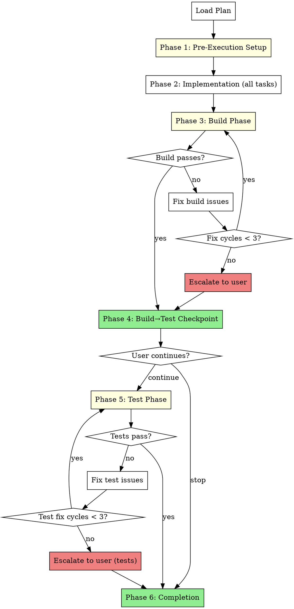

# One-Shot Development

Execute all plan tasks sequentially without human checkpoints, then run build and test phases with fix loops.

**Core principle:** Trust the plan. Execute everything, validate at the end.

**Warning:** This mode is NOT recommended for most use cases. Use only when:
- The plan is well-tested and unambiguous
- You trust the agent to execute without oversight
- You want minimal interaction during implementation

<requirements>
## Requirements

1. Execute all tasks without human checkpoints. Pausing defeats one-shot purpose.
2. Run build phase with fix loops (max 3 cycles). Unlimited loops risk infinite execution.
3. Ask user before proceeding to test phase. Build success is a natural checkpoint.
4. Invoke finishing-a-development-branch at completion. Standard completion pattern.
</requirements>

## When to Use

**Use this skill when:**
- Plan is comprehensive with exact file paths and complete code
- Tasks are independent enough that mid-flight adjustments aren't needed
- You want to "fire and forget" and review only at build/test phase
- Plan has been validated through research and assumption checking

**Don't use when:**
- Plan has vague tasks ("add validation", "improve error handling")
- Tasks have complex interdependencies that might need runtime adjustment
- This is exploratory work where you expect to change direction
- You want human oversight during implementation

## Arguments

- Plan path: First argument (e.g., `docs/hyperpowers/plans/feature.md`)

## The Process



## Phase 1: Pre-Execution Setup

Same as other execution modes. Present offers before task loop begins.

<verification>
### Pre-Execution Verification

Before starting implementation:

- [ ] On base branch? If yes, present Branch Creation Offer
- [ ] Primary issue exists? If yes, present Status Update Offer

User can decline any offer - the requirement is presentation, not execution.
</verification>

### Branch Creation Offer (if on base branch)

Check if on main/master/develop:
```bash
git branch --show-current
```

If on base branch:
```
AskUserQuestion(
  questions: [{
    question: "Create feature branch for this work?",
    header: "Branch",
    options: [
      {label: "Yes", description: "Create branch: feature/<plan-name>"},
      {label: "Skip", description: "Stay on current branch"}
    ],
    multiSelect: false
  }]
)
```

### Status Update Offer (if issue tracked)

If primary issue identified (from plan header or branch name):
```
AskUserQuestion(
  questions: [{
    question: "Update issue [ISSUE-ID] status to in-progress?",
    header: "Status",
    options: [
      {label: "Yes", description: "Mark issue [ISSUE-ID] as in-progress"},
      {label: "Skip", description: "Leave status unchanged"}
    ],
    multiSelect: false
  }]
)
```

After offers complete (or skipped), proceed to Phase 2.

## Phase 2: Implementation (No Checkpoints)

**Purpose:** Execute ALL tasks from the plan sequentially without pausing for human input.

### Execution Flow

1. Load plan from argument path
2. For each task in plan:
   - Show progress: "**Implementing Task N/M:** [task title]"
   - Execute task following plan specifications exactly
   - Update progress file after each task
   - **Do NOT pause for user feedback**
3. When all tasks complete, proceed to Phase 3

### What the Main Agent Does

- Follow plan specifications exactly (this is one-shot, not exploratory)
- Write code directly (no subagent dispatch)
- Note discovered work in progress file (do not act on it mid-flight)
- Show brief progress output after each task

### What the Main Agent Does NOT Do

- Pause for human checkpoints (defeats one-shot purpose)
- Dispatch implementation subagents (preserves context)
- Run build/tests mid-flight (validation is Phase 3+)
- Ask for feedback before all tasks complete

### Progress Tracking

Update `docs/hyperpowers/current-progress.md` after each task:

```markdown
# One-Shot Development Progress

## Plan
docs/hyperpowers/plans/feature-plan.md

## Mode
One-Shot (no checkpoints)

## Status
Implementing Task 4/10

## Completed Tasks
- [x] Task 1: Setup project structure
- [x] Task 2: Add base API client
- [x] Task 3: Add error handling

## Remaining Tasks
- [ ] Task 4: Add retry logic ← in progress
- [ ] Task 5: Add rate limiting
...

## Discovered Work
- [ ] "Need timeout configuration" (discovered in Task 3)
```

<verification>
**Implementation Completion Gate** (Required):

- [ ] All plan tasks executed (none skipped)
- [ ] Progress file shows all tasks marked [x]
- [ ] Discovered work appended (if any found)

**STOP CONDITION:** If ANY unchecked, do NOT proceed. Complete all tasks before proceeding to Phase 3.
</verification>

## Phase 3: Build Phase

**Purpose:** Validate that all implemented code compiles/builds successfully.

### Build System Detection

Detect build command from project manifests (in priority order):

| Manifest File | Build Command |
|--------------|---------------|
| `package.json` (with `scripts.build`) | `npm run build` |
| `Cargo.toml` | `cargo build` |
| `pyproject.toml` | `python -m build` |
| `Makefile` | `make` |
| `go.mod` | `go build ./...` |

If no manifest found:
```
AskUserQuestion(
  questions: [{
    question: "No build system detected. What build command should I use?",
    header: "Build",
    options: [
      {label: "Skip build", description: "No build needed for this project"},
      {label: "Custom command", description: "I'll provide a build command"}
    ],
    multiSelect: false
  }]
)
```

### Build Loop

```
fix_cycles = 0
MAX_CYCLES = 3

while fix_cycles < MAX_CYCLES:
    run build command

    if build succeeds:
        proceed to Phase 4
        break

    if build fails:
        analyze error output
        apply targeted fix
        fix_cycles += 1

if fix_cycles >= MAX_CYCLES:
    escalate to user
```

### 3-Strike Escalation (Build)

After 3 failed fix cycles:

```
AskUserQuestion(
  questions: [{
    question: "Build failed after 3 fix attempts. How do you want to proceed?",
    header: "Escalate",
    options: [
      {label: "Continue trying", description: "Reset counter and try more fixes"},
      {label: "Skip build", description: "Proceed to checkpoint without passing build"},
      {label: "Stop", description: "Pause execution, I'll investigate"}
    ],
    multiSelect: false
  }]
)
```

<verification>
**Build Phase Gate** (Required):

- [ ] Build command identified (or user confirmed skip)
- [ ] Build passes OR user approved skip after escalation
- [ ] Fix cycles documented (show count)

**STOP CONDITION:** If ANY unchecked, do NOT proceed. Do not proceed to checkpoint with failing build unless user explicitly approved via escalation.
</verification>
