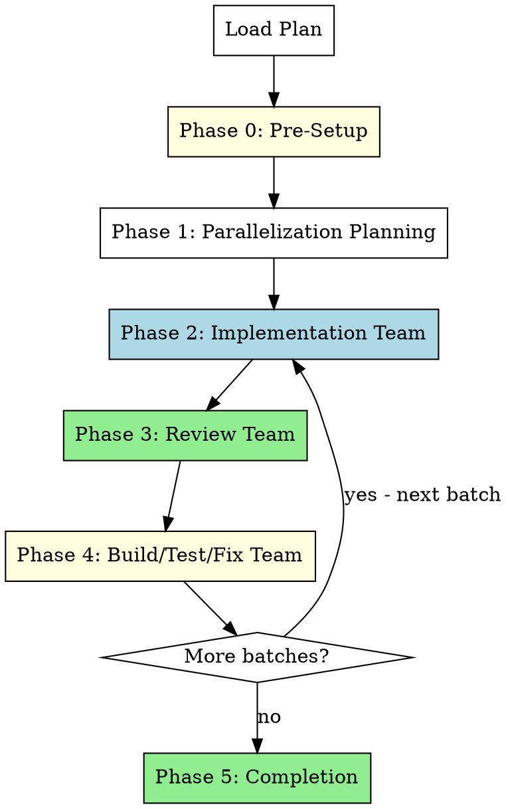

# Team-Driven Development

Execute plan using agent teams for parallel implementation, collaborative review, and coordinated build/test/fix cycles. A parallelization planner groups tasks into batches; each batch cycles through implementation team -> review team -> build/test/fix team.

**Core principle:** Maximize parallel execution through agent teams. Each batch of independent tasks runs simultaneously via teammates, reviewed collaboratively, and built/tested as a unit.

<requirements>
## Requirements

1. Run parallelization planner before team phases begin. Skipping produces serial execution.
2. One team per phase — clean up before spawning next team. Violating causes session conflicts.
3. Maximum 3 fix cycles per phase before escalating. Unlimited loops risk infinite execution.
4. Commit changes between team phases. Next team needs clean git state.
</requirements>

<compliance-anchor>
You have invoked this skill. You MUST:
- Follow phases in order (no skipping)
- Complete all gates (no self-exemptions)
- Produce required outputs (no substitutions)

Failure to comply = skill failure. There is no "partial compliance."
</compliance-anchor>

## When to Use

**Use this skill when:**
- Plan has mostly independent tasks that can be parallelized
- You want maximum execution speed through parallel agent teams
- You accept higher token cost for faster, collaborative execution
- `CLAUDE_CODE_EXPERIMENTAL_AGENT_TEAMS` is enabled

**Don't use when:**
- `CLAUDE_CODE_EXPERIMENTAL_AGENT_TEAMS` is not enabled (technical prerequisite)

### Common Rationalizations (ALL INVALID)

These thoughts mean you're about to skip agent teams. STOP.

| Thought | Reality |
|---------|---------|
| "Plan has only 2 tasks, teams are overkill" | Even 2 tasks benefit from team review and build/test/fix phases. No minimum threshold. |
| "Tasks are sequential, can't parallelize" | Sequential tasks still get batched — the parallelization planner handles this. Teams still provide collaborative review and build/test/fix. |
| "Token cost is too high" | Quality, review collaboration, and parallel build/test/fix outweigh token cost. Not a valid reason. |
| "I'll use subagent-driven instead, it's more efficient" | If agent teams are available, use them. Subagent mode is a fallback when teams are unavailable. |

## Arguments

- Plan path: First argument (e.g., `docs/hyperpowers/plans/feature.md`)

## The Process



## Phase 0: Pre-Execution Setup

Same as other execution modes. Present offers before team phases begin.

<verification>
### Pre-Execution Verification

Before starting implementation:

- [ ] On base branch? If yes, present Branch Creation Offer
- [ ] Primary issue exists? If yes, present Status Update Offer

User can decline any offer — the requirement is presentation, not execution.
</verification>

### Branch Creation Offer (if on base branch)

Check if on main/master/develop:
```bash
git branch --show-current
```

If on base branch:
```
AskUserQuestion(
  questions: [{
    question: "Create feature branch for this work?",
    header: "Branch",
    options: [
      {label: "Yes", description: "Create branch: feature/<plan-name>"},
      {label: "Skip", description: "Stay on current branch"}
    ],
    multiSelect: false
  }]
)
```

### Status Update Offer (if issue tracked)

If primary issue identified (from plan header or branch name):
```
AskUserQuestion(
  questions: [{
    question: "Update issue [ISSUE-ID] status to in-progress?",
    header: "Status",
    options: [
      {label: "Yes", description: "Mark issue [ISSUE-ID] as in-progress"},
      {label: "Skip", description: "Leave status unchanged"}
    ],
    multiSelect: false
  }]
)
```

## Phase 1: Parallelization Planning

**Purpose:** Analyze the implementation plan and group tasks into parallel batches with zero file overlap.

Dispatch a pre-team subagent (NOT a team — this is a single Task() call) to produce the parallelization plan:

```
Task(description: "Analyze plan for parallelization",
     prompt: "You are a parallelization planner.

Read the implementation plan at [plan-path].

[Include full content of agents/execution/parallelization-planner.md here as the prompt]

Save the parallelization plan to docs/hyperpowers/parallelization-plan.md",
     model: "haiku",
     subagent_type: "general-purpose")
```

<verification>
### Parallelization Planning Gate (Required)

After planner completes:

- [ ] Parallelization plan exists at `docs/hyperpowers/parallelization-plan.md`
- [ ] Every task from the implementation plan appears in exactly one batch
- [ ] Each batch has explicit file overlap check (zero overlap confirmed)
- [ ] Batch dependencies are documented

**STOP CONDITION:** If plan is missing or incomplete, re-dispatch planner. Do not proceed to Phase 2.
</verification>

### Lead Review of Parallelization Plan

After the planner produces the plan, the lead (you) must review it:

1. Read `docs/hyperpowers/parallelization-plan.md`
2. Verify file overlap checks are correct (no two tasks in a batch modify the same file)
3. Verify dependencies are respected (dependent tasks in later batches)
4. If issues found: manually correct the plan or re-dispatch planner with feedback

## Phase 2: Implementation Team (per batch)

**Purpose:** Spawn an agent team to implement all tasks in the current batch in parallel.

### For each batch from the parallelization plan:

**Step 1: Create the implementation team**

**Create an agent team** named "Implementation: Batch N" with one teammate per task in the batch:

For each task in the batch, spawn a teammate with:
- The full task text from the implementation plan (not a file path reference)
- The file boundaries from the parallelization plan (which files this task may modify)
- The instruction: "You are implementing this task in parallel with other teammates. Do NOT modify files outside your assignment. If you discover you need to modify a shared file, message the lead before proceeding."
- Use the implementer prompt template from `skills/subagent-driven-development/implementer-prompt.md` as a base, adapted for team context

**Step 2: Require plan approval**

Before teammates begin making changes, require plan approval:
- Each teammate presents their implementation plan
- The lead (you) reviews each plan to verify file assignments don't conflict
- Use `approvePlan` for plans that respect file boundaries
- Use `rejectPlan` for plans that would modify files outside their assignment, with feedback on what to change

**Step 3: Monitor implementation**

- Use delegate mode — do not implement tasks yourself
- If a teammate messages about an unexpected file dependency, assess and either:
  - Approve the file modification (if no conflict with other teammates)
  - Redirect to a different approach that stays within file boundaries
- Wait for all teammates to complete their tasks

**Step 4: Commit and cleanup**

After all teammates complete:
1. Stage and commit all changes: `git add -A && git commit -m "feat: implement batch N tasks"`
2. Request shutdown for all teammates
3. Wait for shutdown approval
4. Call cleanup to remove team resources
5. Retry cleanup up to 3 times if it fails
6. If cleanup fails after 3 retries, escalate to user

<verification>
### Implementation Team Gate (Required)

Before proceeding to Phase 3:

- [ ] All tasks in batch implemented by teammates
- [ ] Plan approval completed for each teammate
- [ ] All changes committed to git
- [ ] Implementation team cleaned up (one team per session)

**STOP CONDITION:** If team cleanup fails after 3 retries, escalate to user. Do NOT spawn review team with active implementation team.
</verification>

### Progress Tracking

Update `docs/hyperpowers/current-progress.md` after each batch:

```markdown
# Team-Driven Development Progress

## Plan
docs/hyperpowers/plans/[plan-name].md

## Mode
Team-Driven (parallel batches)

## Parallelization Plan
docs/hyperpowers/parallelization-plan.md

## Batch 1: DONE
- task-1: DONE
- task-3: DONE
- task-5: DONE

## Batch 2: IN_PROGRESS
- task-2: IN_PROGRESS
- task-4: IN_PROGRESS

## Batch 3: PENDING
- task-6: PENDING

## Discovered Work
- [ ] "Need timeout configuration" (discovered in Batch 1)
```

## Phase 3: Review Team (per batch)

**Purpose:** Spawn a review team to simultaneously verify spec compliance and code quality for the batch.

### Step 1: Create the review team

**Create an agent team** named "Review: Batch N" with two reviewer teammates:

1. **Spec Compliance Reviewer** — spawn with:
   - The task specs from the implementation plan for all tasks in the current batch
   - The git diff showing changes made by the implementation team
   - The instruction: "Review the changes made by Batch N implementers against the spec at [plan path]. Check that each task's acceptance criteria are met. Share findings with the Code Quality Reviewer as you go."
   - Use the spec reviewer prompt template from `skills/subagent-driven-development/spec-reviewer-prompt.md` as a base

2. **Code Quality Reviewer** — spawn with:
   - The task specs from the implementation plan
   - The git diff showing changes
   - The instruction: "Review the changes made by Batch N for code quality: naming conventions, patterns consistency, OWASP Top 10, error handling. Share findings with the Spec Compliance Reviewer as you go."
   - Use the code quality reviewer prompt template from `skills/subagent-driven-development/code-quality-reviewer-prompt.md` as a base

### Step 2: Monitor review

Reviewers should:
1. Conduct their specialized review simultaneously
2. Message each other about overlapping concerns in real-time
3. If the spec reviewer finds a spec violation that also has code quality implications (or vice versa), discuss it together
4. Reach consensus on a unified list of issues, categorized by severity
5. When done, report the unified findings to the lead

### Step 3: Process review results

**If no issues found:** Clean up review team, proceed to Phase 4.

**If issues found:**
1. Clean up review team
2. Apply fixes directly (for straightforward issues) or dispatch a fix subagent via Task()
3. Spawn a new review team to verify fixes
4. Maximum 3 review cycles before escalating to user:

```
AskUserQuestion(
  questions: [{
    question: "Review found issues after 3 fix cycles for Batch N. How to proceed?",
    header: "Escalate",
    options: [
      {label: "Continue trying", description: "Reset counter and try more fixes"},
      {label: "Skip review", description: "Proceed to build/test with known issues"},
      {label: "Stop", description: "Pause execution, I'll investigate"}
    ],
    multiSelect: false
  }]
)
```

### Step 4: Cleanup

1. Commit any review-driven fixes
2. Request shutdown for all reviewer teammates
3. Wait for shutdown approval
4. Call cleanup to remove team resources
5. Retry cleanup up to 3 times

<verification>
### Review Team Gate (Required)

Before proceeding to Phase 4:

- [ ] Both reviewers completed their reviews
- [ ] Cross-domain discussion occurred (spec + quality reviewers communicated)
- [ ] Issues addressed or user approved skip
- [ ] Review team cleaned up
- [ ] Changes committed

**STOP CONDITION:** If review team cleanup fails after 3 retries, escalate to user. Do NOT spawn build/test team with active review team.
</verification>

## Phase 4: Build/Test/Fix Team (per batch)

**Purpose:** Spawn a team to build, test, and fix any issues found during building and testing.

### Step 1: Create the build/test/fix team

**Create an agent team** named "Build/Test/Fix: Batch N" with three teammates:

1. **Build Runner** — spawn with content from `agents/execution/build-runner.md` plus:
   - "You are working on Batch N. Start the build immediately."

2. **Test Runner** — spawn with content from `agents/execution/test-runner.md` plus:
   - "You are working on Batch N. Wait for the Build Runner to confirm the build passes before running tests."

3. **Fix Specialist** — spawn with content from `agents/execution/fix-specialist.md` plus:
   - "You are working on Batch N. Wait for failure reports from the Build Runner or Test Runner before starting work."

### Step 2: Monitor execution

The team should self-coordinate:
1. Build Runner starts immediately
2. Test Runner waits for build pass confirmation (via team message)
3. Fix Specialist activates when issues are reported
4. Cycle: fix -> re-build -> re-test until green

### Step 3: Track fix cycles

```
fix_cycles = 0
MAX_CYCLES = 3

Monitor team messages. Each time Fix Specialist applies a fix and
Build Runner or Test Runner re-runs:
    fix_cycles += 1

if fix_cycles >= MAX_CYCLES and still failing:
    escalate to user
```

### 3-Strike Escalation (Build/Test)

After 3 failed fix cycles:

```
AskUserQuestion(
  questions: [{
    question: "Build/test still failing after 3 fix cycles for Batch N. How to proceed?",
    header: "Escalate",
    options: [
      {label: "Continue trying", description: "Reset counter and try more fixes"},
      {label: "Skip to next batch", description: "Proceed with known failures"},
      {label: "Stop", description: "Pause execution, I'll investigate"}
    ],
    multiSelect: false
  }]
)
```

**If different tests fail each cycle:** Escalate immediately (architectural issue). Do not count as normal fix cycle.

### Step 4: Cleanup

After build and tests pass (or user approves skip):
1. Commit any fixes
2. Request shutdown for all teammates
3. Wait for shutdown approval
4. Call cleanup to remove team resources
5. Retry cleanup up to 3 times

<verification>
### Build/Test/Fix Team Gate (Required)

Before proceeding to next batch or completion:

- [ ] Build passes OR user approved skip
- [ ] Tests pass OR user approved skip
- [ ] Fix cycles documented
- [ ] Build/test/fix team cleaned up
- [ ] Changes committed

**STOP CONDITION:** If team cleanup fails after 3 retries, escalate to user.
</verification>

## Phase 5: Batch Cycling and Completion

### Batch Cycling

After Phase 4 completes for a batch:

1. Check the parallelization plan for remaining batches
2. If more batches remain:
   - Update progress file (mark current batch DONE)
   - Proceed to Phase 2 (Implementation Team) for the next batch
3. If all batches complete:
   - Proceed to Completion

### Completion

**Step 1: Final Verification**

Use `hyperpowers:verification-before-completion`:
- Evidence-based completion checklist
- Discovered work offers
- Original issue update offer

**Step 2: Cleanup Transient Files**

```bash
rm -f docs/hyperpowers/current-progress.md
rm -f docs/hyperpowers/parallelization-plan.md
rm -rf docs/hyperpowers/handoffs/
```

Note: These files are gitignored. Only cleanup AFTER verification passes.

**Step 3: Finish**

Use `hyperpowers:finishing-a-development-branch` skill:
- Offers 4 completion options (merge, PR, keep, discard)
- Issue close offer (if primary issue tracked)
- Worktree cleanup offer (if in worktree)

## Red Flags

| Violation | Why It's Critical | Recovery |
|-----------|-------------------|----------|
| Spawning new team without cleaning up previous | One team per session limitation | Clean up current team first (3 retries) |
| Implementing tasks yourself instead of delegating | Defeats parallelization purpose | Use delegate mode, spawn teammates |
| Skipping parallelization planning | May miss parallel opportunities | Run planner first |
| > 3 fix cycles without escalation | Risk of infinite loops | Escalate to user after 3 cycles |
| Different tests failing each cycle | Architectural issue, not transient | Escalate immediately |
| Teammates modifying files outside assignment | File conflicts cause lost work | Verify during plan-approval |
| Proceeding to next phase without cleanup | Session conflict | Cleanup, retry 3 times, escalate |
| Plain text questions instead of AskUserQuestion | User can't respond via structured UI | Use AskUserQuestion tool |

## Integration

**Required workflow skills:**
- **hyperpowers:verification-before-completion** - Final evidence-based verification
- **hyperpowers:finishing-a-development-branch** - Complete development after all tasks

**Agent definitions used:**
- `agents/execution/parallelization-planner.md` - Task() subagent for Phase 1
- `agents/execution/build-runner.md` - Teammate in Phase 4
- `agents/execution/test-runner.md` - Teammate in Phase 4
- `agents/execution/fix-specialist.md` - Teammate in Phase 4
- `skills/subagent-driven-development/implementer-prompt.md` - Base template for Phase 2 teammates
- `skills/subagent-driven-development/spec-reviewer-prompt.md` - Base template for Phase 3 teammates
- `skills/subagent-driven-development/code-quality-reviewer-prompt.md` - Base template for Phase 3 teammates

<completion-check>
Before announcing completion, verify you followed the skill:
- [ ] Completed all phases in order (0 -> 1 -> 2 -> 3 -> 4 -> cycling -> 5)
- [ ] Passed all verification gates
- [ ] Produced required outputs (implemented code, progress tracking)

If ANY unchecked, go back and complete missing steps.
</completion-check>

<requirements>
## Requirements Reminder

1. Run parallelization planner before team phases begin.
2. One team per phase — clean up before spawning next team.
3. Maximum 3 fix cycles per phase before escalating.
4. Commit changes between team phases.
</requirements>
