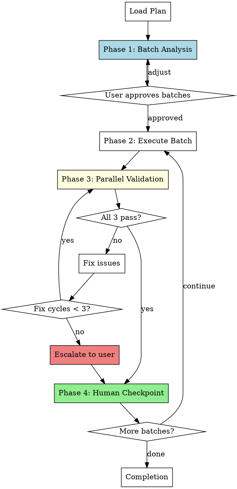

# Validated Batch Development

Execute plans by grouping tasks into buildable batches, then validating each batch in parallel before proceeding.

**Core principle:** Intelligent batching based on buildability + parallel 3-validator dispatch after each batch.

<requirements>
## Requirements

1. Dispatch batch analyzer before execution. Fixed-size batches ignore buildability.
2. Three validators in parallel after each batch. Sequential validation wastes time.
3. Max 3 fix cycles per batch before escalating. Infinite loops degrade quality.
4. Human checkpoint after each batch. EU AI Act requires human oversight.
</requirements>

## When to Use

- Executing implementation plans where buildability matters
- Want parallel validation (build + spec + code review) after each batch
- Prefer speed of parallel validation over sequential human review per task
- Have plans with interdependent tasks that need buildability boundaries

## Arguments

- Plan path: First argument (e.g., `docs/hyperpowers/plans/feature.md`)

## The Process

