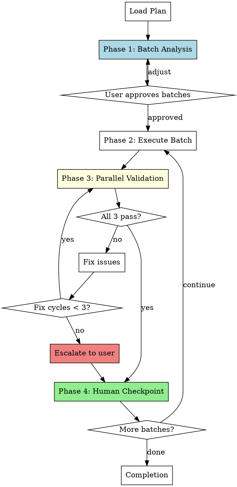

# Validated Batch Development

Execute plans by grouping tasks into buildable batches, then validating each batch in parallel before proceeding.

**Core principle:** Intelligent batching based on buildability + parallel 3-validator dispatch after each batch.

<requirements>
## Requirements

1. Dispatch batch analyzer before execution. Fixed-size batches ignore buildability.
2. Three validators in parallel after each batch. Sequential validation wastes time.
3. Max 3 fix cycles per batch before escalating. Infinite loops degrade quality.
4. Human checkpoint after each batch. EU AI Act requires human oversight.
</requirements>

## When to Use

- Executing implementation plans where buildability matters
- Want parallel validation (build + spec + code review) after each batch
- Prefer speed of parallel validation over sequential human review per task
- Have plans with interdependent tasks that need buildability boundaries

## Arguments

- Plan path: First argument (e.g., `docs/hyperpowers/plans/feature.md`)

## The Process



## Phase 1: Batch Analysis

**Purpose:** Group tasks into batches where each batch leaves the codebase in a buildable, testable state.

### Dispatch Batch Analyzer

```
Task(description: "Analyze plan for batch boundaries",
     prompt: "[Use batch-analyzer-prompt.md template]",
     model: "haiku",
     subagent_type: "general-purpose")
```

**Analyzer Input:**
- Full plan document text
- Project file structure (`tree -L 2`)
- Build system detection (package.json, Cargo.toml, pyproject.toml, etc.)

**Analyzer Output:**
```markdown
## Proposed Batches

### Batch 1 (Tasks 1-3)
- Task 1: Create data model
- Task 2: Add database migration
- Task 3: Implement repository layer
**Rationale:** Creates complete data layer that can be built and tested independently.

### Batch 2 (Tasks 4-5)
- Task 4: Add API endpoint
- Task 5: Add request validation
**Rationale:** Adds HTTP layer on top of data layer.
```

### User Approval Flow

Present proposed batches via AskUserQuestion:

```
AskUserQuestion(
  questions: [{
    question: "Proposed batch boundaries based on buildability. How do you want to proceed?",
    header: "Batches",
    options: [
      {label: "Approve", description: "Accept these batch boundaries"},
      {label: "Adjust", description: "I want to specify different groupings"}
    ],
    multiSelect: false
  }]
)
```

If user selects "Adjust":
- Ask for free-text description of desired changes
- Re-dispatch analyzer with adjustments
- Present new boundaries for approval

<verification>
### Batch Analysis Gate

Before proceeding to execution:

- [ ] Analyzer dispatched with plan + file structure + build system
- [ ] User approved batch boundaries via AskUserQuestion
- [ ] Batches documented in progress file

Proceeding without user-approved batches defeats the intelligent batching purpose.
</verification>

## Phase 2: Execution

**Purpose:** Main agent implements all tasks in the current batch directly.

**Key Principle:** The main agent writes code directly, not through subagents. This preserves:
- Full context across tasks (no context loss from fresh subagents)
- Ability to make cross-task adjustments as implementation reveals issues
- Direct feedback loop between implementation and validation

### Execution Flow

1. Mark batch as in-progress (update TodoWrite)
2. For each task in batch:
   - Mark task as in-progress
   - Implement the task following plan specifications
   - Run task-level tests if specified
   - Mark task as completed
3. When all tasks in batch complete, proceed to validation

### What the Main Agent Does

- Follow plan specifications exactly
- Write tests as part of implementation (when plan includes them)
- Use existing patterns from codebase exploration
- Note any deviations from plan for spec review

### What the Main Agent Does NOT Do

- Dispatch implementation subagents (preserves context)
- Run full build/tests (validation phase handles this)
- Ask user for approval mid-batch (checkpoint is after validation)

### Progress Tracking

Update `docs/hyperpowers/current-progress.md` after each task:

```markdown
## Validated Batch Development Progress

**Plan:** docs/hyperpowers/plans/feature-plan.md
**Status:** Batch 2/4 in progress

### Approved Batches
- Batch 1 (Tasks 1-3): Complete
- Batch 2 (Tasks 4-6): In Progress ← current
- Batch 3 (Tasks 7-8): Pending
- Batch 4 (Tasks 9-10): Pending

### Completed Tasks
- [x] Task 1: Setup project structure
- [x] Task 2: Add base API client
- [x] Task 3: Add error handling

### Current Batch Tasks
- [x] Task 4: Add retry logic ← just completed
- [ ] Task 5: Add rate limiting ← in progress
- [ ] Task 6: Add tests

### Fix Cycles This Batch
0/3

### Discovered Work
- [ ] "Need timeout configuration" (discovered in Task 4)
```

<verification>
### Batch Execution Gate

Before proceeding to validation:

- [ ] All batch tasks executed (not skipped)
- [ ] Progress file updated with completed tasks
- [ ] Discovered work appended (if any found)

Incomplete batch execution produces incomplete validation.
</verification>